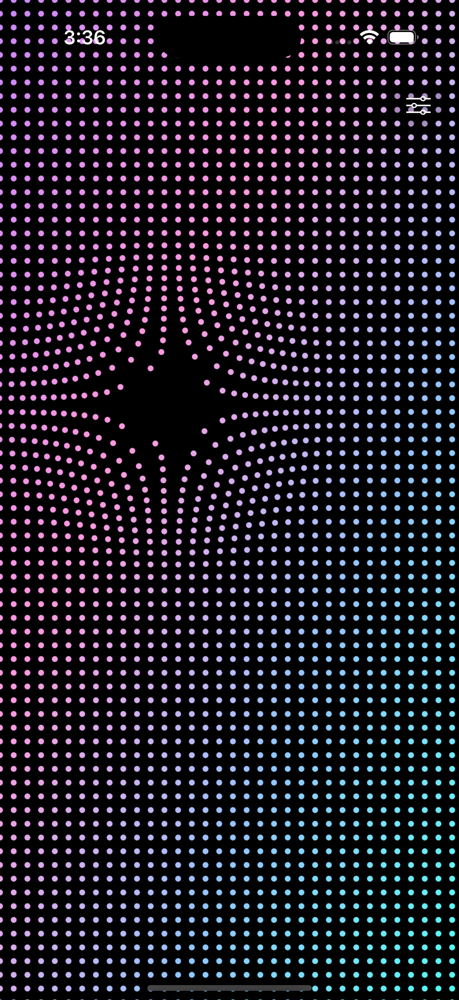
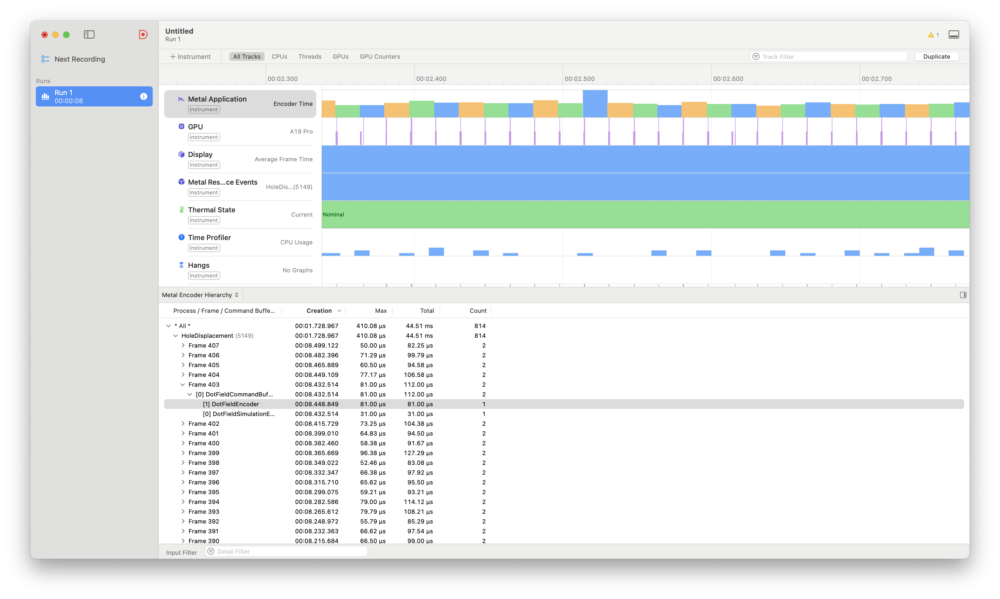

## Performance

Measured to be 10000 FPS (0.1ms per frame render).

## Cost analysis 

* CPU one-time: app launch builds render & compute pipelines, allocates rest-position/state/instance buffers, and constructs the dot grid during the initial layout (or after orientation changes). These costs are front-loaded; grid rebuilds only happen on density/size changes or view-resize events.

* GPU one-time: pipeline compilation and buffer initialization; no recurring heavy GPU work until the first frame.

* CPU every frame: rotate triple-buffered pointers, sample active touches, fill the small touch/uniform structs, update global time, and encode two command encoders (compute + render). There’s no per-dot CPU math anymore, so frame cost is mostly fixed overhead plus whatever time is spent marshaling touches.

* GPU every frame: run `updateDots` once (one thread per dot) for spring integration and gradient-driven displacement, then execute a single instanced draw of the quad impostors. GPU cost scales almost linearly with dot count; touch count only adds a tiny loop inside each kernel invocation.